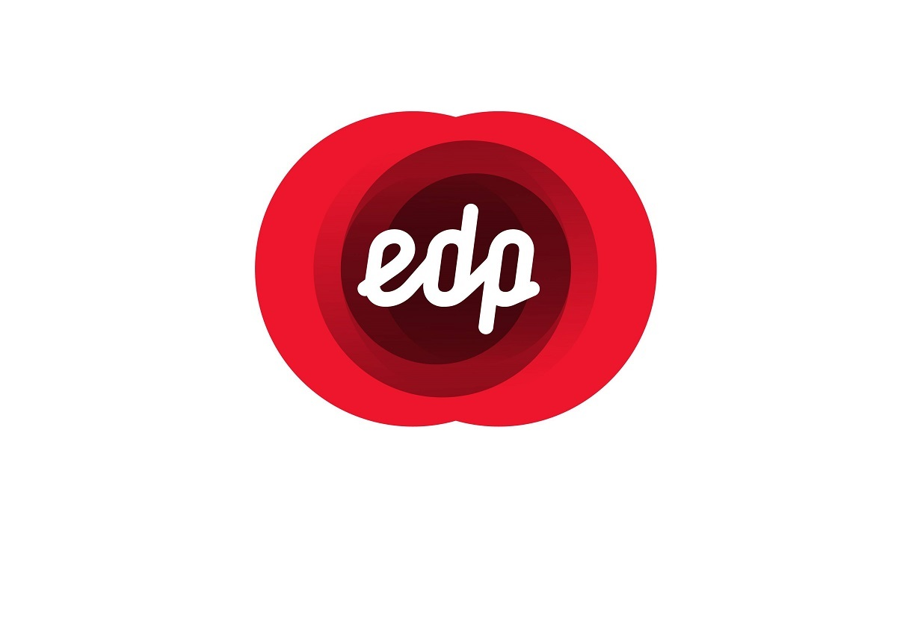

<h1 align="center">
    
</h1>

<h3 align="center">
  EDP Online - iOS Application
</h3>

“Não espere para plantar, apenas tenha paciência para colher”!</blockquote>

  

  

  

  

  

  

  <a href="#rocket-descrição">Descrição</a>&nbsp;&nbsp;&nbsp;|&nbsp;&nbsp;&nbsp;
  <a href="#iphone-screenshot">Screenshot</a>&nbsp;&nbsp;&nbsp;|&nbsp;&nbsp;&nbsp;
  <a href="#memo-licença">Licença</a>

## :rocket: Descrição

Aplicação desenvolvida para o hackathon proposto pela empresa de energia EDP - Energias de Portugal, durante a mentoria do hackathon nos foi proposto desenvolver uma solução para melhor atender o cliente. Trabalhamos em cima dos dados dispostos, e identificamos a necessidade de prever queda de árvores sob a fiação. O aplicativo permite conectar os clientes, que alimentam o sistema identificando árvores que possivelmente podem cair. Esses clientes são pontuados, e podem trocar os pontos por prêmios ou batimento da fatura mensal.

## :computer: Tecnologias e Ferramentas

- [Swift](https://www.apple.com/br/swift/)
- [Alamofire](https://cocoapods.org/pods/Alamofire)
- [Cocoapods](https://cocoapods.org)

## :iphone: Screenshot

<h2 align="center">

  
  
  
  
  
  
  
  
  
  
  
  

</h2>

## :memo: Licença

Esse projeto está sob a licença MIT. Veja o arquivo [LICENSE](LICENSE) para mais detalhes.

---

Projeto desenvolvido by Igor Clemente :wave:
